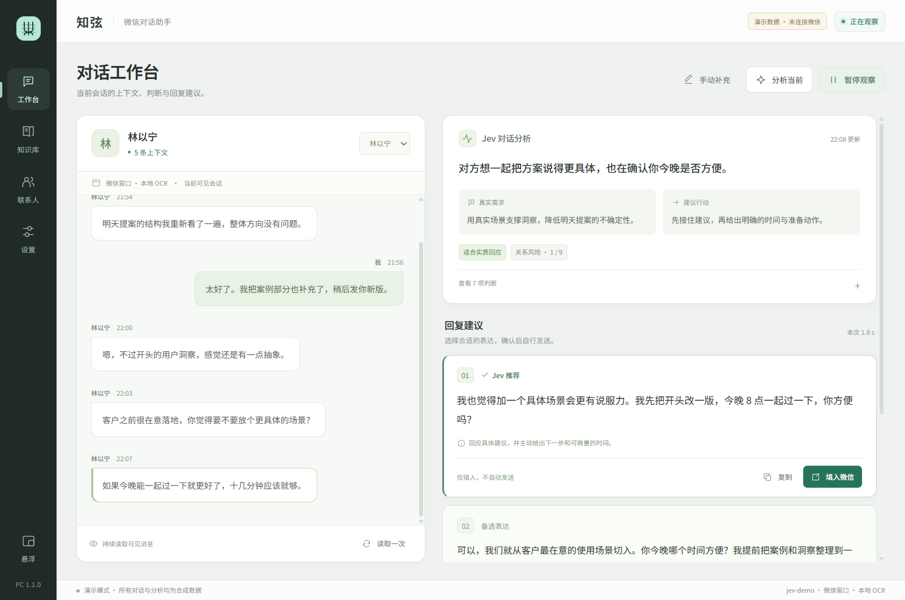
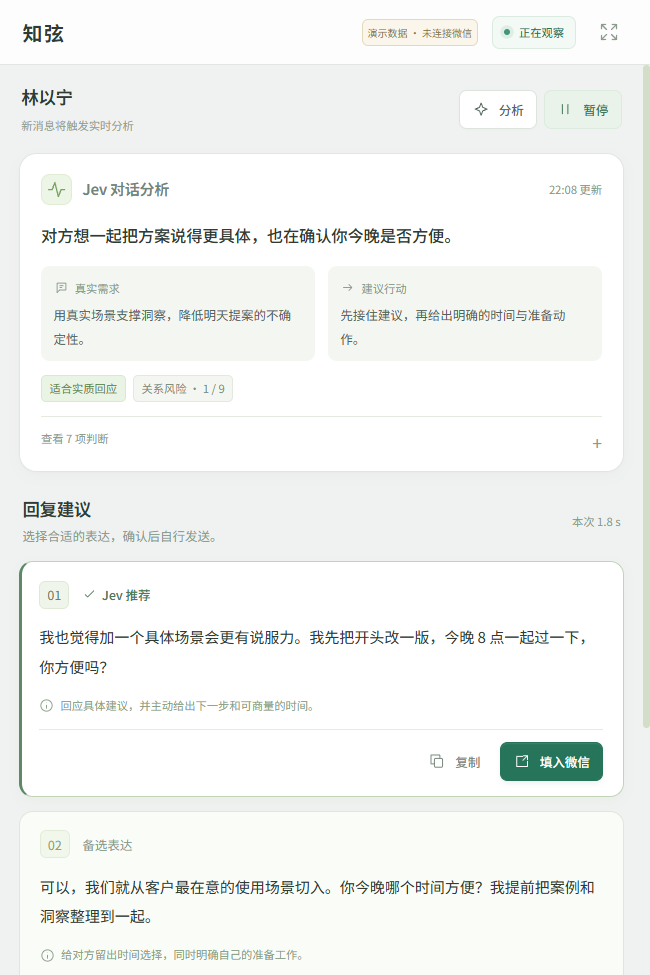
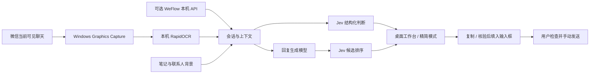

# 知弦 PC

**读懂眼前的对话，想好再回复。**

知弦 PC 是面向 Windows 微信的开源对话助手：在本机识别当前聊天的可见文字，用 Jev 分析可能的意图、需求与回应风险，再生成候选回复。你可以复制或填入输入框，最后由你检查、修改和发送。

A Windows WeChat conversation assistant with local OCR, Jev judgments, and reply drafts. You stay in control of what gets sent.

**当前版本：1.1.0** · [下载 Windows 便携版](https://github.com/DiscoveryH2/zhixian-wechat/releases/latest) · [快速开始](#快速开始) · [隐私说明](docs/PRIVACY.md) · [开发指南](docs/DEVELOPMENT.md) · [常见问题](docs/TROUBLESHOOTING.md)

## 看看界面

### 对话工作台

会话、判断与候选回复在同一个窗口中，笔记和联系人资料用于补充上下文。



### 精简模式

保留当前判断和候选，适合放在微信旁边，也可以设置窗口置顶。



> 两张截图均为合成演示数据，不包含真实联系人或聊天记录。图中的判断、分数和回复仅用于展示界面。

## 快速开始

目标环境为 **Windows 10 / Windows 11、微信 Windows 4.x**。窗口布局、缩放和微信版本会影响 OCR；当前不提供 macOS 或 Linux 客户端。

1. 从 [Releases](https://github.com/DiscoveryH2/zhixian-wechat/releases/latest) 下载 Windows 便携包，**完整解压**后运行 `Zhixian.exe`。便携版包含 Python 运行环境和离线 OCR 模型，不需要另装 Python、Node 或安卓手机，也不需要微信数据库密钥。
2. 在设置中填写下面三项，点击“测试连接”，确认结果后保存。
3. 打开微信，进入需要辅助的聊天，保持窗口可见且未最小化，点击“开始观察”。默认会分析新收到的文字；可以暂停观察或关闭自动分析，改为手动分析。

| 设置 | OpenRouter 配置示例 |
| --- | --- |
| API Key | 你自己的 OpenRouter API Key |
| Base URL | `https://openrouter.ai/api` |
| Model name | `typesafe/jev-1.13` |

**只需一把 OpenRouter Key。** 默认用它调用 Jev 做判断，并调用回复模型起草候选；高级设置留空即可使用这套默认配置。判断、起草和候选排序都会产生服务商 API 用量。连接测试也会发起小型真实请求，但使用内置测试文字，不发送你的聊天记录。

当前默认回复模型为 `deepseek/deepseek-v4.1-flash`，可以在高级设置更换；具体模型能否使用取决于服务商和账号权限。接口测试失败时，先看返回提示，再参阅[连接排查](docs/TROUBLESHOOTING.md#模型连接失败)。

## 能做什么

- **读取当前聊天**：Windows 窗口捕获与离线中文 OCR，区分自己和对方的文字；支持暂停、恢复和单次读取。
- **分析对话**：展示字面含义、可能意图、需求、建议行动、危险等级、是否适合实质回应与回应升级风险。
- **准备回复**：生成最多三条候选，并由 Jev 排序；生成失败时仍保留有效判断，缺失的分数不会被编造。
- **由你确认**：复制候选，或在重新核验微信窗口和会话后填入输入框。程序不按 Enter，也不点击发送。
- **补充背景**：本地联系人、姓名别名、关系、备注，以及支持标签和常驻背景的知识笔记。
- **整理会话**：独立会话时间线、可选历史保存、精简模式、窗口置顶和系统托盘。
- **手动分析**：粘贴文字对话，使用 `我：` / `对方：` 区分发言人。
- **可选数据源**：已有兼容版 WeFlow 的用户可以通过本机 HTTP / SSE 读取消息。

Jev 的意图、风险和概率是**基于有限上下文的模型估计**，不代表对方的真实想法，也不保证回复效果。上游 `should_reply_now` 关注下一条回复是否应包含实质内容，不是自动发送或立即发送的指令。

## 判断与生成如何配合

Jev 负责结构化判断；聊天生成模型负责把回复写出来。两者使用不同的接口，程序会分别处理失败状态。

| 配置方式 | 判断 | 候选回复 |
| --- | --- | --- |
| OpenRouter 默认配置 | Jev decisions 接口 | 同一 Key 调用默认回复模型 |
| TypeSafe 原生接口 | Jev systemone 接口 | 需在高级设置另配生成服务 |
| 自定义网关 | 必须兼容 Jev typed answers 协议 | 可配置 Chat Completions 服务 |

TypeSafe 原生配置示例为 `https://api.typesafe.ai/v1` 和 `jev-latest`。它可以单独提供判断；未配置生成服务时，界面会明确显示判断模式。普通 Chat Completions 接口仅更改模型名，不能替代 Jev 判断协议。

设置独立回复服务时，需要填写回复模型和对应地址；**不同服务来源不会自动继承主 API Key**。详见[开发指南中的模型路由](docs/DEVELOPMENT.md#模型路由)。

## 架构



界面使用 PySide6、QtWebEngine 和本地 HTML/CSS/JS。采集、OCR 和模型请求在后台执行；截图在内存中处理，模型收到的是选定的文字上下文。

## 隐私与使用边界

**本地 OCR 不等于离线 AI 分析。** 点击分析，或开始观察并启用自动分析后，选中的近期聊天、匹配的笔记和联系人背景会发送到你配置的模型服务。服务商的数据保留政策由服务商决定。

| 数据 | 保存方式 |
| --- | --- |
| 截图 | 仅在内存中处理，不作为图片发给模型 |
| API Key、回复 Key、WeFlow Token | 使用 Windows DPAPI 加密后保存 |
| 设置、笔记、联系人 | 保存在本机 JSON 文件中，未加密 |
| 聊天历史 | 默认不保存；开启后以本机明文 JSON 保存 |
| 候选复制或填入 | 使用系统剪贴板，可能受 Windows 剪贴板历史或同步设置影响 |

便携版数据默认位于可执行文件旁的 `data/`；源码运行时位于项目根目录的 `data/`。关闭历史保存会删除应用保存的历史文件，不会删除笔记或联系人。请勿把自己的数据目录放进仓库、发行包或问题报告。更多细节见[隐私说明](docs/PRIVACY.md)。

OCR 只读取当前可见文字，不能遍历所有聊天、恢复屏幕外完整历史或理解语音、图片。微信窗口被其他窗口遮挡通常仍可采集，但隐藏到托盘、最小化或界面布局变化可能使采集停止。标题不清、会话变化或候选过期时，填入会被拒绝；同名联系人、OCR 误识别等情况仍需要你核对。

## 可选 WeFlow

默认 OCR 路线不依赖 WeFlow 或 CipherTalk。若你已有可以正常读取微信的兼容版 WeFlow，可在其设置中启用 HTTP API 和主动推送，再到知弦高级设置选择 WeFlow，填写本机地址（默认 `http://127.0.0.1:5031`）和 API Token。

适配器使用 `/api/v1/sessions`、`/api/v1/messages` 和 `/api/v1/push/messages`，仅接受 loopback 地址。自动探测只访问 `/health`；选用并开始后才读取聊天。不同 WeFlow 版本的接口可能不同，需要单独验证。本仓库不分发 WeFlow、CipherTalk 或微信数据库密钥提取组件。

## 从源码运行

需要 Windows 和 Python 3.12。在仓库根目录执行：

```powershell
py -3.12 -m venv .venv
.\.venv\Scripts\python.exe -m pip install -r requirements-lock.txt
.\.venv\Scripts\python.exe scripts/fetch_font.py
.\.venv\Scripts\python.exe src/main.py
```

仅预览合成数据，不读取微信、不调用模型：

```powershell
.\.venv\Scripts\python.exe src/main.py --demo
.\.venv\Scripts\python.exe src/main.py --demo --compact
```

运行测试与构建：

```powershell
.\.venv\Scripts\python.exe -m unittest discover -s tests -v
.\.venv\Scripts\python.exe -m compileall -q src
powershell -ExecutionPolicy Bypass -File scripts/build.ps1
.\.venv\Scripts\python.exe scripts/package_portable.py
```

构建输出位于 `outputs/Zhixian/`。目录结构、接口协议、测试范围和打包检查见[开发指南](docs/DEVELOPMENT.md)。欢迎通过 Issue 或 Pull Request 改进兼容性；提交前请阅读[贡献指南](CONTRIBUTING.md)，安全问题请按[安全说明](SECURITY.md)处理。

## 许可与致谢

本项目新增代码采用 [MIT License](LICENSE)。基于 [Jev 聊天助手](https://github.com/jev-chat/jev-chat-jarvis) 二次开发，并复用 [jev-chat-windows](https://github.com/jev-chat/jev-chat-windows) 的 Windows 捕获、OCR 和输入框填入基础。

上游代码、版权声明、MIT 许可证及 Android 项目的 NOTICE 保留在 `vendor/` 中；第三方运行组件各自的许可见 [THIRD_PARTY_NOTICES.md](THIRD_PARTY_NOTICES.md)。知弦 PC 是独立项目，不代表 Jev、TypeSafe 或微信官方，也不暗示上游作者背书。
