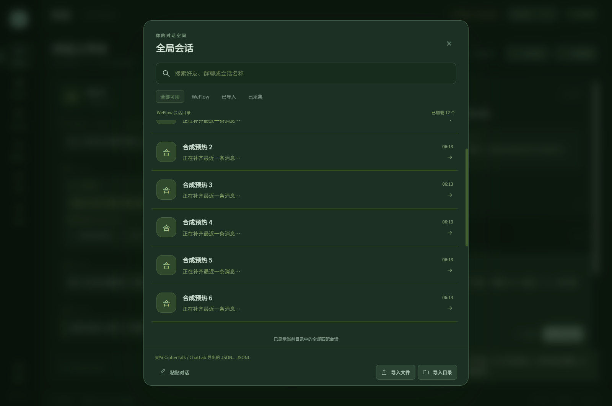
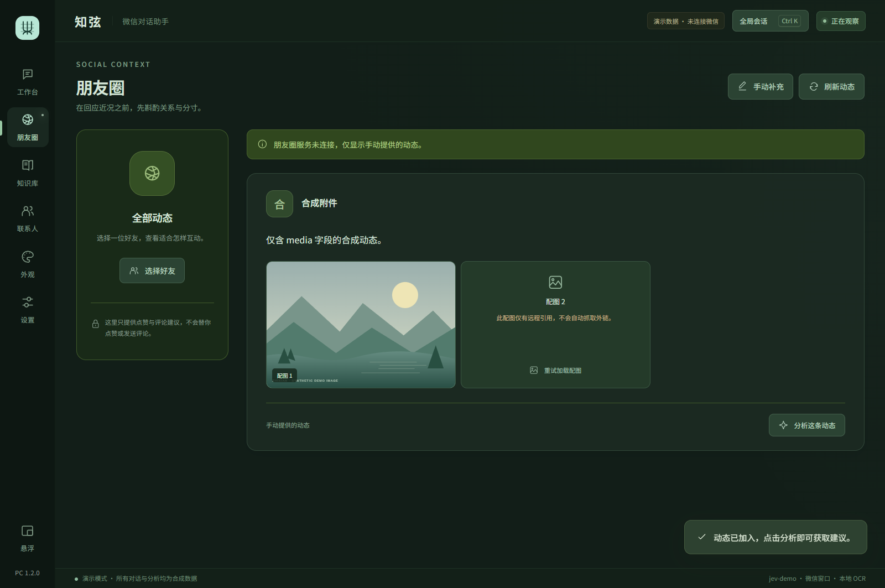
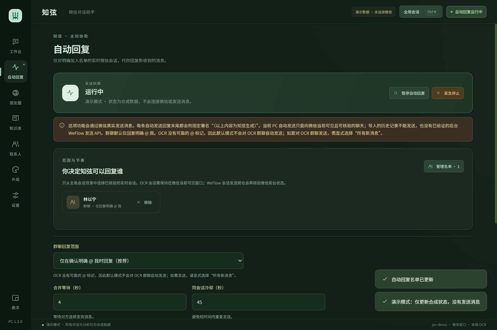
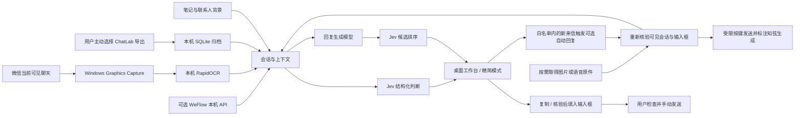

# 知弦 PC

**读懂眼前的对话，想好再回复。**

知弦 PC 是面向 Windows 微信的开源对话助手：可从本机微信数据库、当前窗口、导入记录或已连接的 WeFlow 取得上下文，用 Jev 分析可能的意图、需求与回应风险，再生成候选回复。通常由你检查、修改和发送；也可单独启用受白名单、会话核验和限额约束的自动回复。

A Windows WeChat conversation assistant with read-only local SQLCipher history, optional OCR, Jev judgments, reply drafts, and tightly scoped automatic replies.

**当前版本：1.5.3 预览版** · [下载 v1.5.3 预览版](https://github.com/DiscoveryH2/zhixian-wechat/releases/tag/v1.5.3) · [1.5.3 发行说明](docs/releases/1.5.3.md) · [快速开始](#快速开始) · [更新记录](CHANGELOG.md) · [隐私说明](docs/PRIVACY.md)

**1.5.3 预览版** 修复托盘微信的静止窗口画面在发送核验时过期、导致明明检测到群消息却在发送前失败的问题；自动回复页会显示具体安全核验原因。后台读取和发送范围见[1.5.1 发行说明](docs/releases/1.5.1.md)，本次修复及验收边界见[1.5.3 发行说明](docs/releases/1.5.3.md)。

## 看看界面

### 四秒开场与对话工作台

开场镜头可跳过，系统减少动态效果时会自动简化。会话、判断与候选回复在同一个窗口中，笔记和联系人资料用于补充上下文。


### 全局会话与朋友圈

在独立弹窗里选择要分析的会话；有可用帖子来源时，再查看朋友圈互动建议。





### 自动回复控制台

会话名单、群聊规则、发送限额和紧急停止集中在独立页面；启用需要再次确认。



### 精简模式

保留当前判断和候选，适合放在微信旁边，也可以设置窗口置顶。


> 以上截图均为合成演示数据，不包含真实联系人或聊天记录；目录预览和朋友圈动态也不代表实际连接了 WeFlow。图中的判断、分数和回复仅用于展示界面。

## 快速开始

目标环境为 **Windows 10 / Windows 11、微信 Windows 4.x**。本机数据库模式需要当前 Windows 用户已有可用的 CipherTalk 账号配置；窗口布局、缩放和微信版本仍会影响可见会话的发送核验。当前不提供 macOS 或 Linux 客户端。

1. 从 [v1.5.3 预览版 Release](https://github.com/DiscoveryH2/zhixian-wechat/releases/tag/v1.5.3) 下载 Windows 便携包，**完整解压**后运行 `Zhixian.exe`。便携版包含 Python、SQLCipher 和离线 OCR 运行环境，不需要另装 Python、Node 或安卓手机。
2. 在设置中填写下面三项，点击“测试连接”，确认结果后保存。
3. 若已有 CipherTalk 账号配置，在设置中选择“本机微信数据库”，点击“开始观察”；打开会话目录选择要分析的联系人或群聊。数据库读取可在微信最小化或收至托盘时继续；自动发送仅处理微信原本已打开的目标会话，届时知弦会短暂恢复窗口核验。没有该配置时可继续使用默认 OCR、WeFlow 或导入记录。

**知弦本身只要求 Jev 的 Key、Base URL 和模型名。** 本机数据库模式复用当前 Windows 用户已配置的 CipherTalk 数据库路径与密钥；知弦不会要求再次粘贴数据库密钥，也不会调用 CipherTalk 的闭源 DLL。新机器若没有这份现成配置，需先建立可用的数据来源。

| 设置 | OpenRouter 配置示例 |
| --- | --- |
| API Key | 你自己的 OpenRouter API Key |
| Base URL | `https://openrouter.ai/api` |
| Model name | `typesafe/jev-1.13` |

**OpenRouter 默认配置只需一把 Key。** 程序用它调用 Jev 做判断，并调用回复模型起草候选；高级设置留空即可。若使用仅提供 Jev 判断的服务，可以先使用判断功能，需要草稿时再配置生成服务。判断、起草和候选排序都会产生服务商 API 用量。连接测试也会发起小型真实请求，但使用内置测试文字，不发送你的聊天记录。

当前默认回复模型为 `deepseek/deepseek-v4.1-flash`，可以在高级设置更换；具体模型能否使用取决于服务商和账号权限。接口测试失败时，先看返回提示，再参阅[连接排查](docs/TROUBLESHOOTING.md#模型连接失败)。

## 能做什么

- **读取本机聊天**：从微信 4.x 加密数据库直接只读连接，按会话分页读取历史与最新消息；已有 CipherTalk 配置时无需截图识别聊天正文。OCR 仍作为可选的当前窗口来源。
- **分析对话**：展示字面含义、可能意图、需求、建议行动、危险等级、是否适合实质回应与回应升级风险。
- **准备回复**：生成最多三条候选，并由 Jev 排序；生成失败时仍保留有效判断，缺失的分数不会被编造。
- **手动确认或受限自动回复**：默认由你检查、填入和发送。可选自动回复每次启动均关闭，必须逐项启用会话白名单；新来信先经独立的 Jev「现在是否值得回复」判断，再分析风险、生成候选并排序。数据库模式使用消息 ID 复核最新入站消息，只在微信窗口标题能唯一对应目标会话、输入框为空且草稿匹配时由知弦进程发送；不会自动切换到屏幕外会话。自动回复添加 `（以上内容为知弦生成）`。脱敏发送阶段记录位于本机 `data/send-audit.jsonl`，不记录聊天正文、候选、标题或 Key。
- **补充背景**：本地联系人、姓名别名、关系、备注，以及支持标签和常驻背景的知识笔记。
- **查找和翻阅会话**：按名称搜索联系人与群聊，先显示一页会话及最后消息摘要，再逐页加载历史；图片、语音等消息保留类型标签。
- **主动导入历史**：支持 ChatLab JSON / JSONL 文件或导出目录，建立本机 SQLite 索引，按会话分页浏览，不把整份历史直接塞进模型。
- **按需处理媒体**：取得真实图片或语音文件后，可预览、识别图片或将语音转成文字；拿不到文件时会说明原因。
- **朋友圈建议**：手动提供动态文字，或读取可用 WeFlow 的朋友圈列表；结合选定背景判断是否适合点赞、公开评论或私下回应，仅提供建议。
- **调整工作区**：精简模式、窗口置顶、系统托盘，以及主题、字号和自选背景。
- **手动分析**：粘贴文字对话，使用 `我：` / `对方：` 区分发言人。
- **其他数据源**：已有兼容版 WeFlow 的用户仍可通过本机 HTTP / SSE 读取消息。

Jev 的意图、风险和概率是**基于有限上下文的模型估计**，不代表对方的真实想法，也不保证回复效果。上游 `should_reply_now` 关注下一条回复是否应包含实质内容，不是自动发送或立即发送的指令。自动回复与一次性历史补回复的适用条件、限制和验证状态见[1.5.3 发行说明](docs/releases/1.5.3.md)。

## 数据来源与范围

| 来源 | 能浏览什么 | 需要什么 |
| --- | --- | --- |
| 微信本机数据库 | 已配置账号在本机数据库中的会话、历史、最新消息摘要 | Windows 微信 4.x 与当前用户已有可用的 CipherTalk 账号配置 |
| 窗口 OCR | 当前可见文字，以及应用已经收集的会话 | 打开的微信聊天窗口 |
| ChatLab 导入 | 你选中的导出文件里包含的会话与历史 | 主动选择 ChatLab JSON / JSONL 文件或目录 |
| WeFlow 本机服务 | 该服务当前能够读取的会话、历史和朋友圈 | 运行中的兼容版 WeFlow、HTTP API 和 Token；实时推送还需开启 SSE |

没有可用的 CipherTalk 配置、WeFlow 或导入记录时，知弦只能读取 OCR 当前可见范围。数据库模式可跨会话浏览，但只覆盖该账号本机实际存在的库；“全部”按当前已启用的来源展示，不承诺跨设备或云端补齐历史。

会话列表先加载一页，随后渐进加载；摘要只预热最近或当前页的少量消息，久远正文按选择的会话取页。不同来源的同名会话保留独立身份，不凭显示名称自动合并。

### 本机微信数据库

在设置中选择“本机微信数据库”。知弦只读打开 `%APPDATA%/ciphertalk/ciphertalk-config.db` 找到当前账号，再用开源 SQLCipher 直接连接微信原始加密数据库及其 WAL。数据库密钥仅在程序内存中传递，不写入知弦配置、不上传，也不生成明文数据库镜像。没有可用配置时会显示不可用，而不会悄悄改用截图读取。

会话目录按微信 `SessionTable` 的最近时间分页，联系人备注与群名用于显示；选中会话后再读取有界消息页。图片、语音目前只能显示类型占位，数据库中的媒体引用不等于原始文件或转写文本。自动回复的上下文来自数据库；发送前仅识别微信窗口的会话标题与输入框，不对聊天正文截图 OCR。若目标会话原本已打开但微信收在托盘，知弦会短暂恢复窗口核验后再恢复；同名会话、最新来信变化、已有草稿或无法确认送达时会拒绝或暂停，不会盲目导航到其他聊天。

### 导入 ChatLab

在历史导入入口选择文件或导出目录。当前按 ChatLab `0.0.x` 结构解析，兼容目标为 CipherTalk 的 `0.0.2` JSON / JSONL 导出；需要会话名称、私聊/群聊类型和 `ownerId` 来区分你的消息。缺少必要字段时会拒绝导入，不猜测发言方向。

如果导出包含媒体，请保持文件和媒体子目录的相对位置。只有 `[图片]`、`[语音]` 等标签、没有实际文件的导出，不能用于图片识别或语音转写。导入只建本机索引，不会自动把全库内容上传到模型。

导入归档保存在 `data/chatlab-index.sqlite3`，**是明文聊天数据**，不受“保存实时历史”开关控制。当前“清空历史”不删除导入归档；清除归档前先退出应用，再按需删除索引及其 SQLite 辅助文件。原始导出和媒体仍留在你选择的位置。

## 图片、语音与朋友圈

图片和语音在你选择处理后才获取或提交，不因打开会话就批量识别。媒体可以来自有实际文件的导出、WeFlow 提供的本机资产，或你主动选择的本机文件。程序不把占位标签当成已经理解的内容。

- **图片**：使用支持视觉输入的生成模型，不由 Jev 直接看图。显式点击识别或选择文件进行识别时，所选图片可能发送到配置的媒体服务。
- **收到的语音**：使用语音转文字（STT）。支持的联网协议与模型需要匹配；本地转写需要另备 `faster-whisper` 和完整离线模型，便携版不默认包含这套语音模型。
- **文字朗读**：文字转语音（TTS）尚未实现，也不提供声音复刻。
- **朋友圈**：来源是手动提供的动态或 WeFlow API。没有服务时，不会从零散图片缓存猜出作者、正文或评论。建议不会自动点赞、评论或私聊。

OpenRouter 下媒体服务可以复用同来源的主 Key 和默认媒体模型；其他服务需要在高级设置配置。默认模型是否可用仍取决于服务商能力和账号权限，OpenAI 原生的 multipart 转写协议当前未适配。模型不可用、文件缺失或格式不支持时会保留明确的失败状态。

朋友圈分析可以使用选定好友的聊天背景。公开评论草稿的生成步骤不接收私聊全文；即便如此，仍需检查是否涉及隐私、事实错误或不合适的亲密程度。未取得配图或历史时，建议会按实际可用文字给出限制说明。

## 判断与生成如何配合

Jev 负责结构化判断；聊天生成模型负责把回复写出来。两者使用不同的接口，程序会分别处理失败状态。

| 配置方式 | 判断 | 候选回复 |
| --- | --- | --- |
| OpenRouter 默认配置 | Jev decisions 接口 | 同一 Key 调用默认回复模型 |
| TypeSafe 原生接口 | Jev systemone 接口 | 需在高级设置另配生成服务 |
| 自定义网关 | 必须兼容 Jev typed answers 协议 | 可配置 Chat Completions 服务 |

TypeSafe 原生配置示例为 `https://api.typesafe.ai/v1` 和 `jev-latest`。它可以单独提供判断；未配置生成服务时，界面会明确显示判断模式。普通 Chat Completions 接口仅更改模型名，不能替代 Jev 判断协议。

设置独立回复服务时，需要填写回复模型和对应地址；**不同服务来源不会自动继承主 API Key**。详见[开发指南中的模型路由](docs/DEVELOPMENT.md#模型路由)。

## 架构



界面使用 PySide6、QtWebEngine 和本地 HTML/CSS/JS。采集、OCR、分页读取和模型请求在后台执行。普通文字分析只提交选定文本；显式媒体处理会按所选模式处理真实图片或音频。

## 隐私与使用边界

**本地 OCR 不等于离线 AI 分析。** 点击分析，或开始观察并启用自动分析后，选中的近期聊天、匹配的笔记和联系人背景会发送到你配置的模型服务。服务商的数据保留政策由服务商决定。

媒体是另一条数据通路：显式使用联网图片理解或语音转写时，选定的媒体字节会发送到对应服务；朋友圈分析若包含可用配图，也可能处理首张配图。使用本地语音模型转写时，转写本身不需要上传音频，但随后提交的文字分析仍可能出网。

| 数据 | 保存方式 |
| --- | --- |
| 窗口 OCR 截图 | 仅在内存中处理，不自动作为图片发给模型 |
| API Key、回复/媒体 Key、WeFlow Token | 使用 Windows DPAPI 加密后保存 |
| 设置、笔记、联系人 | 保存在本机 JSON 文件中，未加密 |
| 实时采集历史 | 默认不保存；开启后以本机明文 JSON 保存 |
| 主动导入的聊天归档 | 本机明文 SQLite 索引，独立于实时历史开关 |
| 导出媒体与自选文件 | 保留在用户选择的位置；预览/处理按需读取，不意味着整份文件已加密 |
| 候选复制或填入 | 使用系统剪贴板，可能受 Windows 剪贴板历史或同步设置影响 |

便携版数据默认位于可执行文件旁的 `data/`；源码运行时位于项目根目录的 `data/`。关闭历史保存只删除实时历史文件，不会删除导入归档、笔记或联系人。DPAPI 保护的是密钥，不是所有聊天。请勿把数据目录、原始导出或媒体放进仓库、发行包或问题报告。更多细节见[隐私说明](docs/PRIVACY.md)与[安全说明](SECURITY.md)。

OCR 只读取当前可见文字，不能遍历所有聊天或恢复屏幕外完整历史。媒体理解需要单独取得原件，不能靠 OCR 的标签补出内容。微信窗口被其他窗口遮挡通常仍可采集，但隐藏到托盘、最小化或界面布局变化可能使采集停止。标题不清、会话变化或候选过期时，填入会被拒绝；同名联系人、OCR 误识别等情况仍需要你核对。

## 可选 WeFlow

默认 OCR 路线不依赖 WeFlow 或 CipherTalk。若你已有可以正常读取微信的兼容版 WeFlow，可在其设置中启用 HTTP API 和主动推送，再到知弦高级设置选择 WeFlow，填写本机地址（默认 `http://127.0.0.1:5031`）和 API Token。

适配器使用已核对的历史 HTTP 接口：`/api/v1/sessions`、`/api/v1/messages`、`/api/v1/push/messages` 和 `/api/v1/sns/timeline`，仅接受 loopback 地址并拒绝重定向。自动探测只访问 `/health`；启用数据源后的列表预热、主动浏览或开始观察才读取相应数据。不同 WeFlow 版本的接口可能不同，需要单独验证。

历史版会话接口没有 offset，知弦通过逐渐扩大会话索引前缀实现分页；消息和朋友圈使用上游真实的 offset 分页。朋友圈的远程媒体链接不会自动代理下载，拿不到安全的本机资产时会显示不可用。本仓库不分发 WeFlow、CipherTalk 或微信数据库密钥提取组件。

## 从源码运行

需要 Windows 和 Python 3.12。在仓库根目录执行：

```powershell
py -3.12 -m venv .venv
.\.venv\Scripts\python.exe -m pip install -r requirements-lock.txt
.\.venv\Scripts\python.exe scripts/fetch_font.py
.\.venv\Scripts\python.exe src/main.py
```

仅预览合成数据，不读取微信、不调用模型：

```powershell
.\.venv\Scripts\python.exe src/main.py --demo
.\.venv\Scripts\python.exe src/main.py --demo --compact
```

运行测试与构建：

```powershell
.\.venv\Scripts\python.exe -m unittest discover -s tests -v
.\.venv\Scripts\python.exe -m compileall -q src
powershell -ExecutionPolicy Bypass -File scripts/build.ps1
.\.venv\Scripts\python.exe scripts/package_portable.py
```

构建输出位于 `outputs/build/Zhixian/`。目录结构、接口协议、测试范围和打包检查见[开发指南](docs/DEVELOPMENT.md)。欢迎通过 Issue 或 Pull Request 改进兼容性；提交前请阅读[贡献指南](CONTRIBUTING.md)，安全问题请按[安全说明](SECURITY.md)处理。

## 许可与致谢

本项目新增代码采用 [MIT License](LICENSE)。基于 [Jev 聊天助手](https://github.com/jev-chat/jev-chat-jarvis) 二次开发，并复用 [jev-chat-windows](https://github.com/jev-chat/jev-chat-windows) 的 Windows 捕获、OCR 和输入框填入基础。

上游代码、版权声明、MIT 许可证及 Android 项目的 NOTICE 保留在 `vendor/` 中；第三方运行组件各自的许可见 [THIRD_PARTY_NOTICES.md](THIRD_PARTY_NOTICES.md)。知弦 PC 是独立项目，不代表 Jev、TypeSafe 或微信官方，也不暗示上游作者背书。
